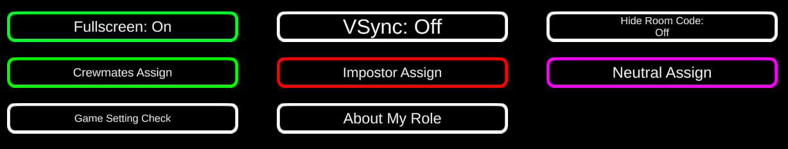

# Town of Moss

当MODは [Town of Us](https://github.com/polusgg/Town-Of-Us)
を個人的に改変した、[Among Us](https://www.innersloth.com/games/among-us/) の非公式MODです。\
蘇生に対応した[AutoMuteUs](#AUCapture-for-MOD)のCaptureツールも公開しています。

### 本MODの特徴
必ずいずれかのインポスターがアサシン（役職を知った相手を会議中にキルできる）能力を持つ設定により、クルーメイトは無闇に役職を他クルーに知られないよう行動、発言する必要があります。\
会議を挟んでもインポスターのキルクールダウンがリセットされないため、開始直後やキルクールダウンリセットのための会議を行う必要がありません。

### 注意
MODの導入されていない2021.11.9のAmong Usディレクトリに展開してください。\
異なるMODの導入されたディレクトリに展開すると正常に動作しません。\
開発途中のため、ゲーム途中で切断されたり予期しない動作が起こる場合がありますが、\
その場合は次のゲーム開始前に全てのプレイヤーが一度ゲームを終了して起動し直すことをおすすめします。\
バイザー部分の隠れる帽子の場合Painterによる着色が全く見えないため、Painter導入の際はバイザーの見える帽子の着用をお願いします。

### v1.0既知の不具合
Phantomがかなり不具合が出るので使用しないようお願いします。

## Releases
### Town of Moss

| Date | Among Us - Version| Mod Version | Link |
|---|----------|-------------|-----------------|
| 21-12-05 | 2021.11.9.5s | v1.0.1 | [Download](https://spiel.jp/mod/Moss101.zip) |
| 21-12-03 | 2021.11.9.5s | v1.0 | [Download](https://spiel.jp/mod/Moss10.zip) |
| 21-11-30 | 2021.6.30s | v0.6 | [Download](https://spiel.jp/mod/Moss06.zip) |
| 21-11-30 | 2021.6.30s | v0.5 | [Download](https://spiel.jp/mod/Moss05.zip) |
| 21-11-27 | 2021.6.30s | v0.442 | [Download](https://spiel.jp/mod/Moss0442.zip) |
| 21-11-24 | 2021.6.30s | v0.441 | [Download](https://spiel.jp/mod/Moss0441.zip) |
| 21-11-22 | 2021.6.30s | v0.44 | [Download](https://spiel.jp/mod/Moss044.zip) |
| 21-11-19 | 2021.6.30s | v0.43 | [Download](https://spiel.jp/mod/Moss043.zip) |
| 21-11-19 | 2021.6.30s | v0.42 | [Download](https://spiel.jp/mod/Moss042.zip) |
| 21-11-18 | 2021.6.30s | v0.41 | [Download](https://spiel.jp/mod/Moss041.zip) |
| 21-11-17 | 2021.6.30s | v0.407 | [Download](https://spiel.jp/mod/Moss0407.zip) |
| 21-11-16 | 2021.6.30s | v0.406 | [Download](https://spiel.jp/mod/Moss0406.zip) |
| 21-11-15 | 2021.6.30s | v0.405 | [Download](https://spiel.jp/mod/Moss0405.zip) |
| 21-11-13 | 2021.6.30s | v0.403 | [Download](https://spiel.jp/mod/Moss0403.zip) |
| 21-11-10 | 2021.6.30s | v0.402 | [Download](https://spiel.jp/mod/Moss0402.zip) |
| 21-11-09 | 2021.6.30s | v0.401 | [Download](https://spiel.jp/mod/Moss0401.zip) |
| 21-11-05 | 2021.6.30s | v0.4 | [Download](https://spiel.jp/mod/Moss04.zip) |

    
 Changelog 

    

        
 v1.0.1 

        <ul>
            <li>CDの長い能力のCDが更に伸びる不具合を修正</li>
            <li>Sniperの勝利条件設定項目を追加</li>
            <li>Snitchの設定項目を追加</li>
            <li>Undertaker、Jesterの死体移動中のVent可能設定追加</li>
            <li>Snitchがタスク完了まで狙撃可能とする設定を追加</li>
            <li>Phantom削除</li>
            <li>動作を全体的に軽量化（多分）</li>
        </ul>
    

    

        
 v1.0 

        <ul>
            <li>11.9バージョンに対応</li>
            <li>全然サポートしてなかったmodifierを削除</li>
        </ul>
    

    

        
 v0.6 

        <ul>
            <li>SecurityGuardのベント封鎖がPolusで機能しない不具合を修正</li>
            <li>CrackerのCrack後にReportできなくなる不具合を修正</li>
        </ul>
    

    

        
 v0.5 

        <ul>
            <li>Ventから出られない場合がある不具合を修正</li>
            <li>Engineerのスキルアイコンの表示の問題を修正</li>
        </ul>
    

    

        
 v0.442 

        <ul>
            <li>ChargerがAdmin情報を得られない不具合を修正</li>
            <li>Camouflager効果中に会議を開始し狙撃された場合の不具合を修正</li>
            <li>SecurityGuardのアイコン表示のミスを修正</li>
        </ul>
    

    

        
 v0.441 

        <ul>
            <li>特定ロールのスキルクールダウンが途中でリセットされる場合がある不具合を修正</li>
        </ul>
    

    

        
 v0.44 

        <ul>
            <li>Engineerの能力設定のデフォルトを、ラウンドごとに使用可能、ベントの中からのみ使用可能に変更</li>
            <li>ロール情報表示で現在の設定を表示するように</li>
            <li>Game Setting Checkで表示される情報を追加</li>
            <li>ゲームメニューからShow Crewmates Role、Show Impostor Role、Show Neutral Role機能を追加</li>
            <li>Snifferの不具合を修正</li>
            <li>Swooperのベント利用設定を追加</li>
            <li>最後のインポスターがSnipeできる設定をCustom Game Optionsに移動</li>
        </ul>
    

    

        
 v0.43 

        <ul> 
            <li>第三陣営の勝利判定の不具合を修正</li>
        </ul>
    

    

        
 v0.42 

        <ul> 
            <li>SecurityGuardによって閉じられたVentから出られる場合がある不具合を修正</li>
            <li>ゲーム中の役職マニュアルを一部更新に合わせ改訂</li>
        </ul>
    

    

        
 v0.407 

        <ul> 
            <li>Admin、セキュリティの残時間の表示を改良</li>
            <li>ロビーでホスト以外でも設定がきちんと見れるよう修正</li>
            <li>他微細な不具合を修正</li>
        </ul>
    

    

        
 v0.406 

        <ul> 
            <li>第三陣営の通知をダイアログで行うように変更</li>
            <li>役職説明、ゲームルール表示をチャットではなくダイアログで表示することで、ゲーム中いつでも見られるように変更</li>
            （Additive Menu Buttonを参照）
        </ul>
    

    

        
 v0.405 

        <ul> 
            <li>Adminの使用時間制限設定でセキュリティカメラも共通で制限時間を消費するように</li>
            <li>Crackerによる停電中にゲームが終了した場合のエラーを修正</li>
        </ul>
    

    

        
 v0.403 

        <ul> 
            <li>Puppeteerの挙動の不具合の修正</li>
            <li>Painterのペイントを重ねられないよう修正修正</li>
            <li>着色中のクルーが回線落ちした際の不具合を修正</li>
            <li>プレイ中にメニューボタンを押した際のエラーを修正</li>
            <li>DollMakerのWaxを受けたプレイヤーが移動し続けるバグを修正</li>
            <li>新役職Snifferの追加</li>
        </ul>
    

    

        
 v0.402 

        <ul> 
            <li>ゲーム終了時にフリーズする不具合の修正</li>
        </ul>
    

    

        
 v0.401 

        <ul> 
            <li>新役職Painterの追加</li>
            <li>Puppeteerの能力使用時に味方インポスターをキルできる不具合の修正</li>
            <li>DollMakerの人形が残っているときに会議が開かれた際に表示が人によって異なる不具合の修正</li>
            <li>Madmateとして割り当てられた役職はAssassinでなくMadmateとして表示</li>
            <li>幽霊が動けるかどうかの設定の追加</li>
            <li>Puppeteerの大幅強化</li>
        </ul>
    

    

        
 v0.4 

        <ul> 
            <li>Druidのラウンドごとの蘇生回数上限設定を追加</li>
            <li>安定性の向上</li>
        </ul>
    

    

        
 v0.397 

        <ul> 
            <li>蘇生までの間に情報を集めることを防止するため、自身の死体があるうちはその場から動けず、視界も生前と同様になるよう変更</li>
        </ul>
    

    

        
 v0.396 

        <ul> 
            <li>DollMakerが味方をキル出来る不具合を修正</li>
        </ul>
    

    

        
 v0.395 

        <ul> 
            <li>admin使用時間制限の処理変更</li>
            <li>不具合のため非公開</li>
        </ul>
    

    

        
 v0.394 

        <ul> 
            <li>PolusでPhantomがAdminのVentからスタートしないように変更</li>
            <li>Crackerなどで発生しうるエラーの対処</li>
            <li>不具合のため非公開</li>
        </ul>
    

    

        
 v0.393 

        <ul> 
            <li>Mayorのボタンの挙動を修正</li>
            <li>Zombie死亡時の勝利判定を修正</li>
            <li>Impostorが狙撃能力を持つとバグるのを修正</li>
            <li>ゲーム開始時に発生する場合があったエラーを修正</li>
        </ul>
    

    

        
 v0.392 

        <ul> 
            <li>TimeLordの巻き戻し中にアウトラインを表示</li>
            <li>TimeLordの能力に関する不具合を修正</li>
        </ul>
    

    

        
 v0.391 

        <ul> 
            <li>Mayorカウンターボタンが設定によらず常に有効だった不具合を修正</li>
            <li>Morphlingがベントできる設定を追加</li>
            <li>Puppeteer憑依中に会議が行われると以降憑依が使えなくなる不具合を修正</li>
        </ul>
    

    

        
 v0.39 

        <ul> 
            <li>PuppeteerのAirshipでの不具合、クールダウン表示の不具合を修正</li>
            <li>ゲーム設定確認ボタン、ロール説明表示ボタンを追加</li>
        </ul>
    

    

        
 v0.38 

        <ul> 
            <li>Sheriff導入時にホストがキックされる不具合を修正</li>
            <li>通常キル以外の要因の死でMayorのボタンが発動する問題を修正</li>
            <li>第三陣営の内訳通知機能を追加</li>
            <li>吸ったり吐いたりするインポスターの名前をPopopoに変更（お察しください）</li>
        </ul>
    

    

        
 v0.378 

        <ul> 
            <li>Executionerが最初の会議でJesterになってしまう不具合を修正</li>
            <li>部屋コードを隠す設定を追加</li>
        </ul>
    

    

        
 v0.377 

        <ul> 
            <li>異なるMODのデータと混在されていた際に警告を出すように</li>
        </ul>
    

    

        
 v0.376 

        <ul> 
            <li>DollMakerのWaxでブリンクするように</li>
            <li>JanitorのCleanのクールダウンが会議後リセットされるように</li>
        </ul>
    

    

        
 v0.375 

        <ul> 
            <li>Popopoのコピー中にキルタイマーが進まないように</li>
            <li>DollMakerのバグを修正</li>
            <li>Executionerのバグを修正</li>
            <li>Zombieの復活待ち中に霊体での移動を不可に</li>
        </ul>
    

    

        
 v0.372 

        <ul> 
            <li>Janitorのデフォルトのクールダウンを長く</li>
            <li>Puppeteerの憑依解除後の硬直時間を3秒に固定</li>
            <li>Puppeteerのクールダウン時間をキルクールダウン時間と共通に</li>
        </ul>
    

    

        
 v0.371 

        <ul> 
            <li>採用役職が少ない場合に本来追加される役職が減る不具合を修正</li>
            <li>インポスターの採用役職が少ない場合にゲームが開始できない不具合を修正</li>
            <li>新規役職がsniperの対象になかった問題を修正</li>
            <li>SecurityGuardのカメラ設置が無効なSkeldで使用されないように</li>
        </ul>
    

    

        
 v0.37 

        <ul> 
            <li>DollMaker追加</li>
        </ul>
    

    

        
 v0.363 

        <ul> 
            <li>Bug Fix</li>
            <li>Popopoベント使用不可に</li>
        </ul>
    

    

        
 v0.352 

            <ul> <li>Bug Fix</li> </ul>
        

        

            
 v0.35 

            <ul> <li>Bug Fix</li> </ul>
        

        

            
 v0.33 

        <ul>
            <li>新役職Popopo追加</li>
            <li>新役職Zombie追加</li>
            <li>Mayor能力変更</li>
        </ul>
    

### AUCapture for MOD

| Version | Link |
|----------|-----------------|
| v1.00 | [Download](https://spiel.jp/mod/AUCapture_MOD.zip) |

AUCapture for MODは[AmongUsCapture](https://github.com/automuteus/amonguscapture) を元に非公式に作成しています。\
ゲーム中の蘇生に対応していますが、追放直後の一度だけミュート解除されないことがあるようです。

-----------------------

# Custom Game Options

| Name | Description | Type | Default |
|----------|:-------------:|:------:|:------:|
| Add Madmate | Madmateを追加する | Toggle | Off |
| Add Glitch | Glitchを追加する | Toggle | Off |
| Number of Neutral Roles | 割り当てられる第三陣営の数 | Number | 0 |
| Kill Cooldown Reset on Meeting | 会議の後にインポスターのキルクールダウンを初期化する | Toggle | Off |
| Camouflaged Comms | コミュニケーションサボタージュ中、カモフラージュ状態になる | Toggle | On |
| Last Impostor Can Snipe  | 最後の一人となったインポスターは狙撃能力を得る | Toggle | On |
| Impostors can see the roles of their team | インポスター同士が互いの役職を知っている | Toggle | On |
| Polus Reactor Time Limit | PolusのMelt Downサボタージュの制限時間 | Time | 45.0s |
| AirShip Reactor Time Limit | AirShipのMelt Downサボタージュの制限時間 | Time | 75.0s |
| Polus Vital Move | PolusのVitalの位置を変更できる。Shipにした場合Drop Ship内にベントが一つ追加される | Default / Labo / Ship / O2 | Default |
| Admin and Security Camera Usable Time | AdminとセキュリティカメラのRoundごとの合計使用可能時間（0なら制限なし） | Time | 0s |
| Dead can see everyone's roles | 死亡後に全員の役職がわかる | Toggle | On |
| Role Appears Under Name | 自身の役職を名前の下に表示する | Toggle | On |
| Report Assigned Neutral Roles | 生存者が半分以下になったあとの会議で、そのゲームで最初に割り当てられた第三陣営の内訳がダイアログとチャットに通知される | Toggle | On |
| Dead Player Can't Move Before Report | 幽霊になっても死体が残っているうちはその場から動けない | Toggle | Off |

-----------------------

# Roles

|**Crewmate Roles**|**Impostor Roles**|**Neutral Roles**|
|----------|-------------|----------|
|[Mayor](#Mayor)|[Janitor](#Janitor)|[Glitch](#Glitch)|
|[Sheriff](#Sheriff)|[Morphling](#Morphling)|[Jester](#Jester)|
|[Engineer](#Engineer)|[Camouflager](#Camouflager)|[Executioner](#Executioner)|
|[Swapper](#Swapper)|[Miner](#Miner)|[Arsonist](#Arsonist)|
|[Investigator](#Investigator)|[Swooper](#Swooper)|[Phantom](#Phantom)|
|[Time Lord](#TimeLord)|[Assassin](#Assassin)|[Sniper](#Sniper)|
|[Medic](#Medic)|[Undertaker](#Undertaker)|[Zombie](#Zombie)|
|[Seer](#Seer)|[Popopo](#Popopo)||
|[SecurityGuard](#SecurityGuard)|[Cracker](#Cracker)||
|[Snitch](#Snitch)|[MultiKiller](#MultiKiller)||
|[Altruist](#Altruist)|[Puppeteer](#Puppeteer)||
|[Charger](#Charger)|[DollMaker](#DollMaker)||
|[Druid](#Druid)|||
|[Sniffer](#Sniffer)|||

-----------------------

# Crewmate Roles

## Mayor

### **Team: Crewmates**

最多得票者が複数いた場合、Mayorに投票されたクルーが追放されます。 \
どこにいても緊急会議を開けるボタンを持っています。\
緊急会議ボタンが未使用のときにキルされると、即座に緊急会議が開かれます。

### Game Options

| Name | Description | Type | Default |
|----------|:-------------:|:------:|:------:|
| Call Meeting On Dead | キルされた際に緊急会議を開く | Toggle | On |

-----------------------

## Sheriff

### **Team: Crewmates**

キルボタンを持っており、第三陣営、インポスターをキルすることができますが、対象がクルーメイトだった場合は自身が死亡します。

### Game Options

| Name | Description | Type | Default |
|----------|:-------------:|:------:|:------:|
| Sheriff Miskill Kills Crewmate | クルーメイトもキルする | Toggle | Off |
| Sheriff Kills Madmate | Madmateもキルできる対象に含む | Toggle | Off |
| Sheriff Kill Cooldown | キルのクールダウン時間 | Time | 25s |
| Sheriff can report who they've killed | 自身でキルした相手をReportできる | Toggle | On |

-----------------------

## Engineer

### **Team: Crewmates**

サボタージュをどこからでも即座に修理できるFixボタンを持っています。\
ベントが使用できます。

### Game Options

| Name | Description | Type | Default |
|----------|:-------------:|:------:|:------:|
| Engineer Fix Per | Roundの場合、会議を行うごとにFixボタンが使用できる | Round / Game | Round |
| Fix Only In Vent | ベントの中にいるときのみFixボタンを使用できる | Toggle | On |

-----------------------

## Swapper

### **Team: Crewmates**

会議中に指定した二人の得票を入れ替えます。各プレイヤーに対してそれぞれ一度しか対象に選べません。\
また、緊急会議ボタンを使用できません。

-----------------------

## Investigator

### **Team: Crewmates**

一定時間ごとに、マップに自身の周辺のクルーの位置と色が表示されます。カモフラージュ状態や障害物に関わらず表示され、対象が死体であった場合、感知できる距離が二倍になります。

### Game Options

| Name | Description | Type | Default |
|----------|:-------------:|:------:|:------:|
| See Someone Range | マップにクルーが表示される距離 | Number | 6.0m |
| See Color Range | クルーの色まで識別できる距離（See Someone Rangeに対する割合） | Number | 30% |
| Map Update Interval | マップ情報が更新される頻度 | Number | 2.0s |

-----------------------

## TimeLord

### **Team: Crewmates**

全プレイヤーの時間を数秒間巻き戻すことができます。その時間内に死亡していたクルーは蘇生されます。\
また、バイタル情報を見ることができません。
巻き戻している間、Time Lordには以下のように青いアウトラインがつきます。\

### Game Options

| Name | Description | Type | Default |
|----------|:-------------:|:------:|:------:|
| Revive During Rewind | 時間内に死亡していたクルーが蘇生する | Toggle | On |
| Has Blue Outline on Rewind | 巻き戻し中、青いアウトラインがつく | Toggle | On |
| Rewind Duration | 巻き戻される時間の秒数 | Time | 3s |
| Rewind Cooldown | 巻き戻すボタンのクールダウン時間 | Time | 35s |

-----------------------

## Medic

### **Team: Crewmates**

ゲーム中一回、他のクルーに対してキルを一度だけ防ぐシールドを張ることができます。 シールドを張られたクルーメイトにキルが行われると、Medicの画面が緑色に点灯します。\
死体のReport時、キルから発見までの経過時間に応じてチャットから以下の追加情報を得られます。

- キルしたクルーの名前
- キルしたクルーの色が暗いか明るいか

| 暗い|明るい|
|----|:-----:|
|Red|Pink|
|Blue|Orange|
|Green|Yellow|
|Black|White|
|Purple|Cyan|
|Brown|Lime|
|Maroon|Rose|
|Tan|Banana|
|Watermelon|Gray|
|Chocolate|Coral|
|Beige|Sky Blue|
| |Hot Pink|
| |Turquoise|
| |Lilac|
| |Rainbow|
| |Azure|

------------------------

### Game Options

| Name | Description | Type | Default |
|----------|:-------------:|:------:|:------:|
| Show Shielded Player | 誰にシールドが見えるか | Self / Medic / Self + Medic / Everyone | Medic |
| Show Medic Reports | 死体発見時に追加情報を得る | Toggle | On |
| Time Where Medic Reports Will Have Name | 追加情報でキルしたクルーの名前が見られるまでの発見時間 | Time | 0s |
| Time Where Medic Reports Will Have Color Type | 追加情報でキルしたクルーの色の濃さがわかるまでの発見時間 | Time | 15s |
| Who gets murder attempt indicator | シールドを張られたクルーにキルが試みられた際の点灯が見えるプレイヤー | Medic / Shielded / Everyone / Nobody | Medic |
| Shield breaks on murder attempt | シールドが一度のキルにより破壊されるかどうか | Toggle | On |

-----------------------

## Seer

### **Team: Crewmates**

占いによってクルーメイトの陣営を知ります。占うためには一定時間触れている必要があり、その間自身は移動できません。\
Zombieを占った場合、Zombieが死亡します。

### Game Options

| Name | Description | Type | Default |
|----------|:-------------:|:------:|:------:|
| Seer Cooldown | 占いを行うクールダウン時間 | Time | 25s |
| Seer Investigating Time | 占いを行うために必要な接触時間 | Time | 3s |
| Info that Seer sees | 占いによって得られる情報 | Role / Team | Team |
| Who Sees That They Are Revealed | 占われたことを知るプレイヤー | Crewmates / Impostors + Neutral / All / Nobody | None |
| Neutrals show up as Impostors | 第三陣営をインポスターと同じ表示にする | Toggle | On |

-----------------------

## SecurityGuard

### **Team: Crewmates**

ゲーム開始時に所持している7つのネジによって、新しいカメラの設置、ベントの封鎖ができます。

| Name | Description | Type | Default |
|----------|:-------------:|:------:|:------:|
| Number Of Screw | ゲーム開始時に所持しているネジの個数 | Number Of Screw | 7 |
| Number Of Screws Per Cam | カメラの設置に必要なネジの個数 | Number | 2 |
| Number Of Screws Per Vent | ベントの封鎖に必要なネジの個数 | Number | 1 |

-----------------------

## Snitch

### **Team: Crewmates**

自身のタスクを完了させることによって誰がインポスターかを知ることができます。\
Polus、Airshipでは、閉じられたドアに触れるだけでドアを開くことができます。

### Game Options

| Name | Description | Type | Default |
|----------|:-------------:|:------:|:------:|
| Sees Neutral Roles | 第三陣営も知れるかどうか | Toggle | Off |
| Open door immediately | いつドアを即座に開けられるか | Always / One Task Left / None | Always |

-----------------------

## Altruist

### **Team: Crewmates**

自身の命と引換えに、クルーの死体を蘇生させます。蘇生には一定時間が必要になります。

### Game Options

| Name | Description | Type | Default |
|----------|:-------------:|:------:|:------:|
| Revive Duration | 蘇生に必要な時間 | Time | 1.0s |
| Target's body disappears | 蘇生中、蘇生対象の死体を見えなくする | Toggle | Off |

-----------------------

## Charger

### **Team: Crewmates**

電力を消費して視界を広げ、Adminで各クルーの色情報が見えます。\
電力はベントに入ることで充電できますが、他のベントへの移動はできません。\
充電が切れた場合、Admin情報を見ることができなくなります。\
Admin閲覧中は消費電力が3倍になります。

### Game Options

| Name | Description | Type | Default |
|----------|:-------------:|:------:|:------:|
| Time to Charge Maximum | 最大まで充電するのにかかる時間 | Time | 1.0s |
| Time to Consume | 電力をすべて消費するのにかかる時間 | Time | 30.0s |

-----------------------

## Druid

### **Team: Crewmates**

死体を一定距離移動させることで蘇生させます。\
距離は、死体を運び始めた位置からどれだけ離れたかによって判定されます。

### Game Options

| Name | Description | Type | Default |
|----------|:-------------:|:------:|:------:|
| Distance to revive dead | 蘇生に必要な距離 | Time | 20.0m |
| Revive Limit Per Limit | ラウンドごとの蘇生可能回数 | No Limit / 1 / 2 / 3 | No Limit |

-----------------------

## Painter

### **Team: Crewmates**

床にペンキを塗ります。\
塗ったペンキは会議を挟んだ後全プレイヤーに視認されるようになり、その上を通過したクルーのバイザー（目の部分）の色を変化させます。\
変化した色は次の会議後まで全てのプレイヤーが視認でき、会議が終わると元に戻ります。

### Game Options

| Name | Description | Type | Default |
|----------|:-------------:|:------:|:------:|
| Paint Color Num | 塗れるペンキの色の数 | 1 / 2 / 3 | 2 |
| Paint Cool Down | ペイントのクールダウン時間 | Time | 25s |

-----------------------

## Sniffer

### **Team: Crewmates**

死体から一定距離以内にいると死体の気配を察知し、死体に近付くほど視界が赤くなります。\
ただし死体を見つけても通報することができず、Adminを見ることもできません。

### Game Options

| Name | Description | Type | Default |
|----------|:-------------:|:------:|:------:|
| Sniffer Can Report | 死体を通報できるか | Toggle | Off |
| Sniff Max Range | 死体を察知できる範囲 | Number | 10m |

-----------------------

# Impostor Roles

## Assassin

### **Team: Impostors**

会議中にクルーの役職を当てることで狙撃し、キルすることができます。\
Last Impostor Can SnipeがOnの場合、インポスター役職として割り当てられません。

### Game Options

| Name | Description | Type | Default |
|----------|:-------------:|:------:|:------:|
| Number of Assassin Kill | ゲーム中狙撃できる最大人数 | Number | 5 |
| Assassin Can Kill Continuous  | 一度の会議中に二人以上狙撃できる | Toggle | On |

-----------------------

## Janitor

### **Team: Impostors**

一定時間死体に隣接することで死体を消し、発見されなくします。

### Game Options

| Name | Description | Type | Default |
|----------|:-------------:|:------:|:------:|
| Clean Cooldown | 死体を消せるクールダウン時間 | Time | 45s |
| Clean Duration | 死体を消すのにかかる時間 | Time | 3.0s |

-----------------------

## Morphling

### **Team: Impostors**

サンプルを取得した対象の姿に変身することができます。\
変身中に再度ボタンを押すことで変身を解除できます。\
変身中はベントを使用できません。（設定による）

### Game Options

| Name | Description | Type | Default |
|----------|:-------------:|:------:|:------:|
| Morph Cooldown | 変身のクールダウン | Time | 15s |
| Morph Duration | 変身の継続時間 | Time | 10s |
| Morphling Can Use Vent | ベントは使えないか、変身中のみ使えないか、いつでも使える | None / On not Morphing / Always | None |

-----------------------

## Camouflager

### **Team: Impostors**

互いのクルーを識別できなくなるカモフラージュ状態を発生させることができます。

### Game Options

| Name | Description | Type | Default |
|----------|:-------------:|:------:|:------:|
| Camouflage Cooldown | カモフラージュ能力のクールダウン時間 | Time | 25s |
| Camouflage Duration | カモフラージュ状態の継続時間 | Time | 5s |

-----------------------

## Miner

### **Team: Impostors**

一定個数までベントを作ることができます。新たなベントと直前に作成したベントがそれぞれ接続されます。

### Game Options

| Name | Description | Type | Default |
|----------|:-------------:|:------:|:------:|
| Mine Cooldown | ベント作成のクールダウン時間 | Time | 20s |
| Max Mine Num | 作成できる最大ベント数 | Number | 5 |

-----------------------

## Swooper

### **Team: Impostors**

一定時間姿を消します。その間に再度使用することで姿を表すこともできます。\
ベントは使用できません。

### Game Options

| Name | Description | Type | Default |
|----------|:-------------:|:------:|:------:|
| Swooper Cooldown | 姿を消すクールダウン時間 | Time | 30s |
| Swooper Duration | 姿を消す最大継続時間 | Time | 5s |

-----------------------

## Undertaker

### **Team: Impostors**

死体を移動させることができます。

### Game Options

| Name | Description | Type | Default |
|----------|:-------------:|:------:|:------:|
| Drag Cooldown | 死体を置いてから次に移動させられるまでのクールダウン時間 | Time | 1s |
| Drag Velocity | 死体移動時の通常時に対する移動速度の割合 | Percent | 100% |

-----------------------

## Cracker

### **Team: Impostors**

次に他の誰かが入ったときに停電する罠を部屋全体に仕掛けます。\
停電中の部屋ではタスク、マップ、通報が使用不可になります。\
罠が設置された部屋は、解除されるまでAdmin情報に人数が映らなくなります。\
Skeldの廊下に仕掛けた場合、すべての廊下が停電状態になります。\
別の部屋でCrackを使用した場合、すでに設置されていたCrackは解除されます。

### Game Options

| Name | Description | Type | Default |
|----------|:-------------:|:------:|:------:|
| Crack Cooldown | クラック能力のクールダウン時間 | Time | 25s |
| Crack Duration | クラック発動時の停電の継続時間 | Time | 10s |

-----------------------

## MultiKiller

### **Team: Impostors**

キルクールが二倍になる代わりに、一定時間以内であれば二人目を連続でキルできます。

### Game Options

| Name | Description | Type | Default |
|----------|:-------------:|:------:|:------:|
| MultiKiller Cooldown Rate | 通常のクールダウンに対するキルクールダウン時間の長さ | Percent | 200% |
| MultiKill Enable Time | 二人目を連続でキルできる秒数 | Time | 5.0s |

-----------------------

## Popopo

### **Team: Impostors**

死体を吸い込んだり吐き出したりします。吸い込んでいる間は対象の姿をコピーします。\
ベントは使用できません。

-----------------------

## Puppeteer

### **Team: Impostors**

一定時間かけて接触している相手に憑依します。\
憑依されたクルーは、次に近付いた他のクルーをキルします。\
キルが発生するかReleaseボタンにより憑依は解除されます。\
憑依解除後数秒は行動が行えません。

### Game Options

| Name | Description | Type | Default |
|----------|:-------------:|:------:|:------:|
| Possess Time | 憑依に必要な接触時間 | Time | 3s
| Possess Max Time | 憑依し続けられる最大時間  | Time | 15s
| Wait Time After Release | 憑依解除後の行動不能時間  | Time | 3s

## DollMaker

### **Team: Impostors**

キルの代わりにクルーを蝋人形状態にします。\
蝋人形になったクルーは行動できなくなり、一定時間が経過するか、他のプレイヤーに触れられるか、ミーティングが始まると死亡します。

### Game Options

| Name | Description | Type | Default |
|----------|:-------------:|:------:|:------:|
| Doll Self Broken Time | 蝋人形にされたクルーが自動で死亡するまでの時間 | Time | 20s

-----------------------

## Madmate

### **Team: Impostors**

Add MadmateがOnのとき、Impostorの数に加えて必ず追加されます。\
Madmateは味方のインポスターが誰かわからず、インポスターからもクルーと同様に見え、キルすることもできます。\
チームはImpostorですが、SheriffやSeerの能力対象とされたときはクルーメイトと同じ結果が出ます。\
キルやベントの使用はできず、勝敗判定ではクルー陣営の数として計算されます。\
Madmateが存在するとき、Assassinがインポスター陣営に採用されることはありません。\
会議のとき、Assassinの狙撃能力を持ちます。

-----------------------

# Neutral Roles

## Glitch

### **Team: Neutral**

誰でもキルすることができ、自分以外のクルーが全員死亡したときのみ勝利となります。\
任意の対象に変身するMimic、対象の能力やタスクを一定時間行えなくするHack、どこでもAdminが使用できます。

### Game Options

| Name | Description | Type | Default |
|----------|:-------------:|:------:|:------:|
| Add Glitch | チェックを入れた場合、Neutral Rolesの数と関係なく、必ずGlitchが誰かに割り当てられます。 | Toggle | Off |
| Glitch Has Portable Admin | どこでもMapからAdmin情報を得られます。 | Toggle | On |
| Mimic Cooldown | Mimic能力のクールダウン時間 | Time | 10s |
| Mimic Duration | Mimic能力の効果時間 | Time | 15s |
| Hack Cooldown | Hack能力のクールダウン時間 | Time | 10s |
| Hack Duration | Mimic能力の効果時間 | Time | 15s |
| Glitch Kill Cooldown | キルクールダウン時間 | Time | 30s |
| Glitch Hack Distance | Hack能力の射程範囲 | Short / Normal / Long | Short |

-----------------------

## Jester

### **Team: Neutral**

会議により追放されると勝利します。 ベントの使用、死体の移動、変身の能力を持ちます。

### Game Options

| Name | Description | Type | Default |
|----------|:-------------:|:------:|:------:|
| Jester Can Use Vents | ベントを使用できる | Toggle | On |
| Jester Can Drag Body | 死体を移動できる | Toggle | On |
| Jester Can Morph | 変身できる | Toggle | On |

-----------------------

## Executioner

### **Team: Neutral**

ゲーム開始時にクルーメイトひとりがターゲットとして指定されます。\
ターゲットを指す矢印が常時表示され、対象が会議で追放されると勝利します。\
ターゲットが追放以外で死亡した場合、役職がJesterになります。

### Game Options

| Name | Description | Type | Default |
|----------|:-------------:|:------:|:------:|
| Executioner becomes on Target Dead | ターゲットが追放以外で死亡した場合に変更される自身の役職 | Crewmate / Jester | Jester |

-----------------------

## Arsonist

### **Team: Neutral**

生存している自分以外のすべてのクルーに油を塗った後にIgniteすると勝利します。 油を塗るためには一定時間接触している必要があります。

### Game Options

| Name | Description | Type | Default |
|----------|:-------------:|:------:|:------:|
| Douse Duration | 油を塗るのに必要な接触時間 | Time | 3.0s |
| Douse Cooldown | 油を塗るクールダウン時間 | Time | 15s |

-----------------------

## Phantom

### **Team: Neutral**

インポスターでないクルーが死亡すると、次の会議後からPhantomとなる可能性があります。Phantomは会議後にランダムなベントから発生し、すべてのタスクを完了させると勝利します。\
半透明ですが、歩いている間は見えやすくなってしまいます。生存しているクルーによってクリックされると死亡します。

-----------------------

## Sniper

### **Team: Neutral**

一度の会議で二人の役職を当てて狙撃すると勝利します。\
役職を間違った場合、自身が死亡します。\
広い視界を持ちます。

### Game Options

| Name | Description | Type | Default |
|----------|:-------------:|:------:|:------:|
| Number of Sniper Kills to Win | 勝利のために必要な狙撃回数 | Number | 2 |

-----------------------

## Zombie

### **Team: Neutral**

インポスターの人数が0または全体の半数以上となったときに、自身のタスクが完了していれば単独勝利します。\
キルされても一定時間後に蘇生しますが、蘇生前に会議が始まるか、追放されるか、Seerに占われた場合は蘇生しません。

### Game Options

| Name | Description | Type | Default |
|----------|:-------------:|:------:|:------:|
| Zombie Revive Time | 蘇生するまでの時間 | Time | 15s |
| Killed By Seer | 占われたときに死亡する | Toggle | On |

-----------------------

# Lobby Setting

ロビーでのゲーム設定では、W、Sで上下スクロール、A、Dでトップとボトムに移動、Shiftを押しながらの数値設定で1/10単位での変更ができます。

-----------------------

# Additive Menu Button

右上の歯車マークから開くメニュー画面に、以下のボタンが追加されています。\
\
ゲーム中に自身のロールの情報とゲームルール、ロールの割り当て確率設定を確認することができます。\

| Name | Description |
|----------|:-------------:|
| Hide Room Code | ONのとき、ロビーでルームコードが非表示になります。 |
| Game Setting Check | 現在のゲーム設定情報の概要が表示されます。 |
| Show Role Manual | 現在の自分のロールの情報を表示します。 |
| Show Crewmates Role | 現在のクルーメイトのロールの割り当て確率設定を表示します。 |
| Show Impostor Role | 現在のインポスターのロールの割り当て確率設定を表示します。 |
| Show Neutral Role | 現在の第三陣営のロールの割り当て確率設定を表示します。 |

-----------------------

# Bug / Suggestions

バグ報告、提案は [Twitter](https://twitter.com/Koke1024) までお願いします。

-----------------------

# Credits & Resources

[Town of Us](https://github.com/polusgg/Town-Of-Us) - The base of this mod.\
[Town of Us R](https://github.com/eDonnes124/Town-Of-Us-R) - Reference mod.\
[Reactor](https://github.com/NuclearPowered/Reactor) - The framework of the mod\
[BepInEx](https://github.com/BepInEx) - For hooking game functions\
[Among-Us-Sheriff-Mod](https://github.com/Woodi-dev/Among-Us-Sheriff-Mod) - For the Sheriff role.\
[ExtraRolesAmongUs](https://github.com/NotHunter101/ExtraRolesAmongUs) - For the Engineer & Medic roles.\
[TooManyRolesMods](https://github.com/Hardel-DW/TooManyRolesMods) - For the Investigator & Time Lord roles.\
[TorchMod](https://github.com/tomozbot/TorchMod) - For the inspiration of the Torch Mod.\
[XtraCube](https://github.com/XtraCube) - For the RainbowMod.\
[PhasmoFireGod](https://twitch.tv/PhasmoFireGod) - Button Art.\
[TheOtherRoles](https://github.com/Eisbison/TheOtherRoles) - For the inspiration of the Child and SecurityGuard roles.

[Essentials](https://github.com/DorCoMaNdO/Reactor-Essentials) - For created custom game options.

#

This mod is not affiliated with Among Us or Innersloth LLC, and the content contained therein is not endorsed or otherwise sponsored by Innersloth LLC. Portions of the materials contained herein are property of Innersloth LLC.

© Innersloth LLC.

